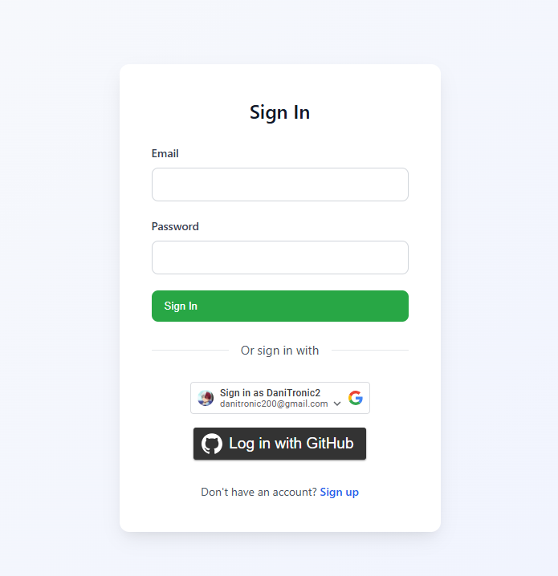
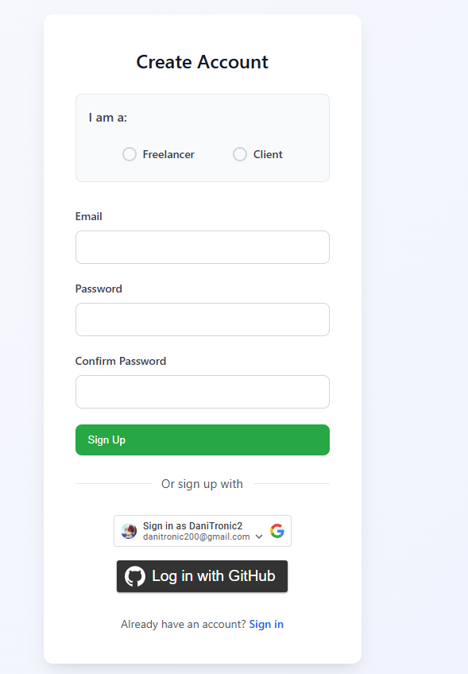
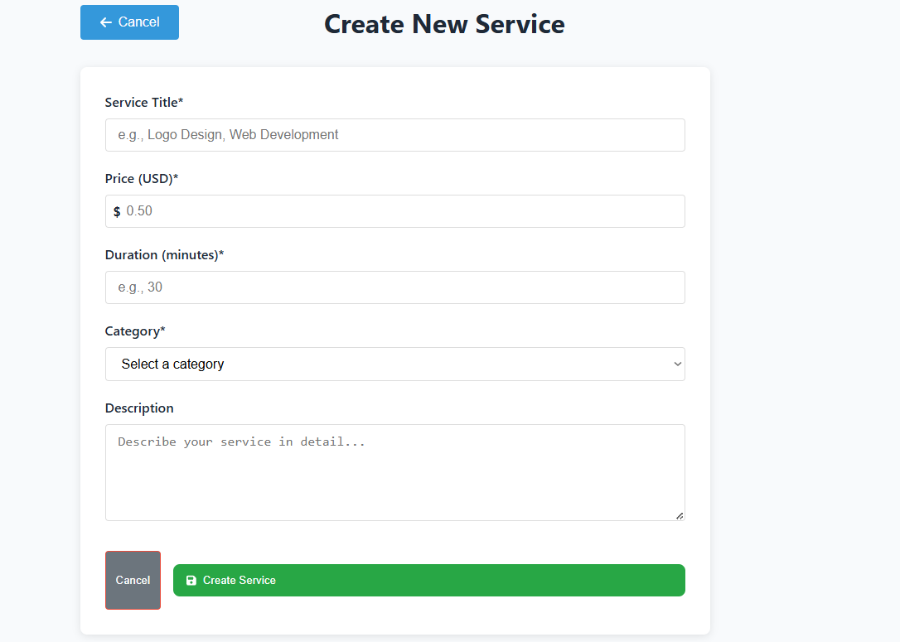
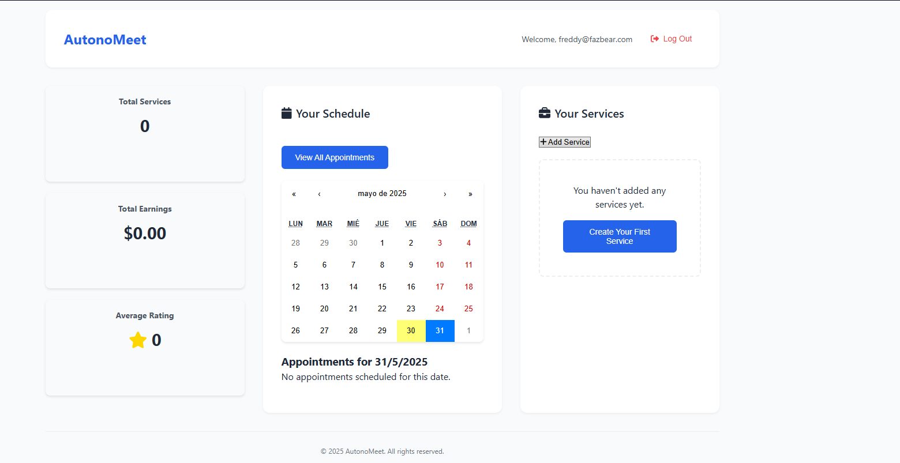
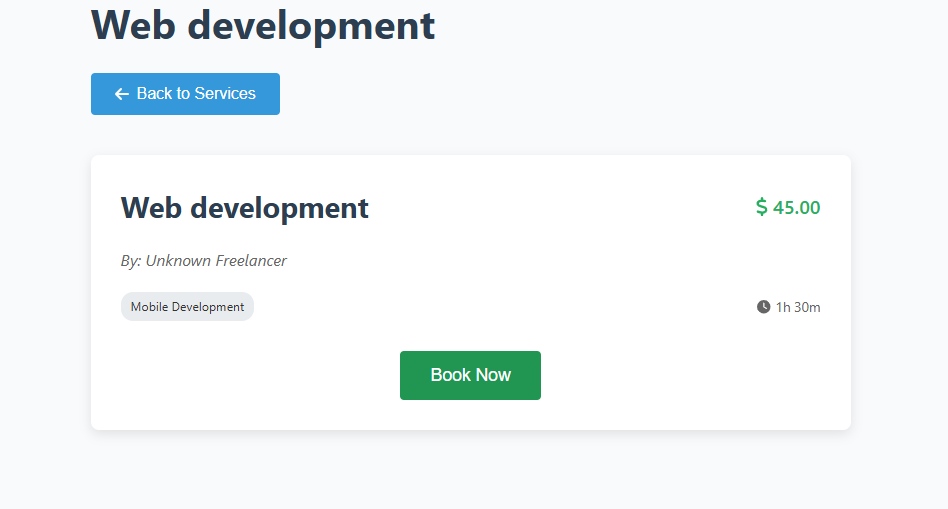
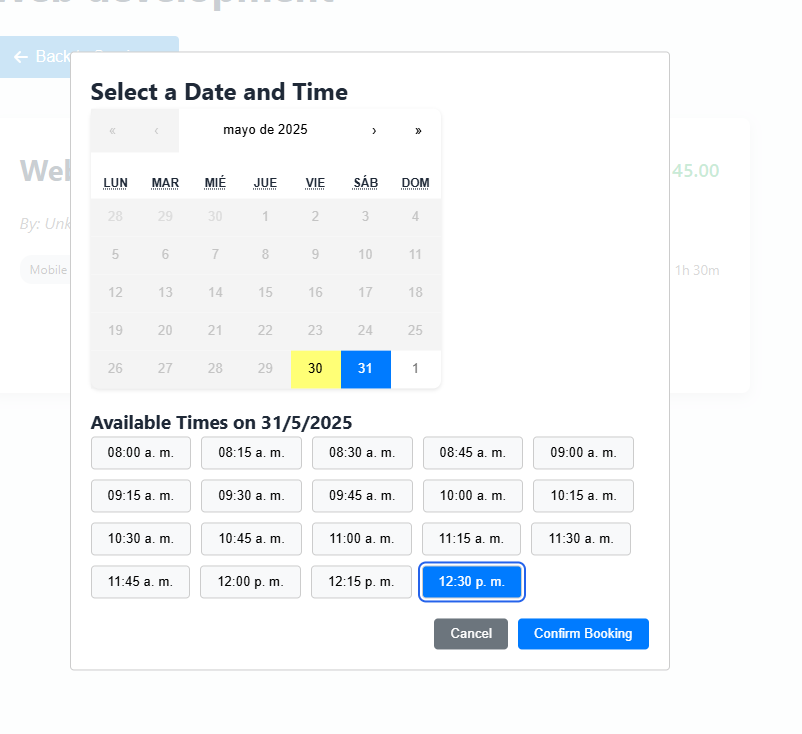
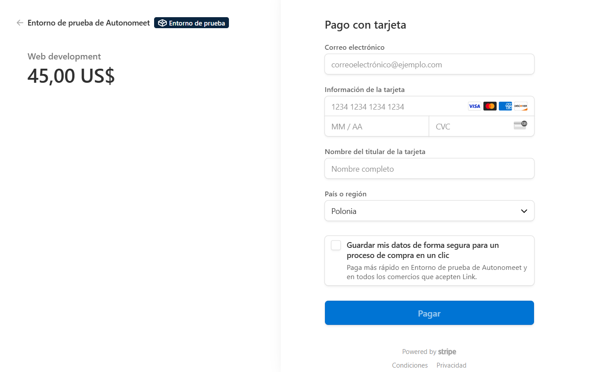
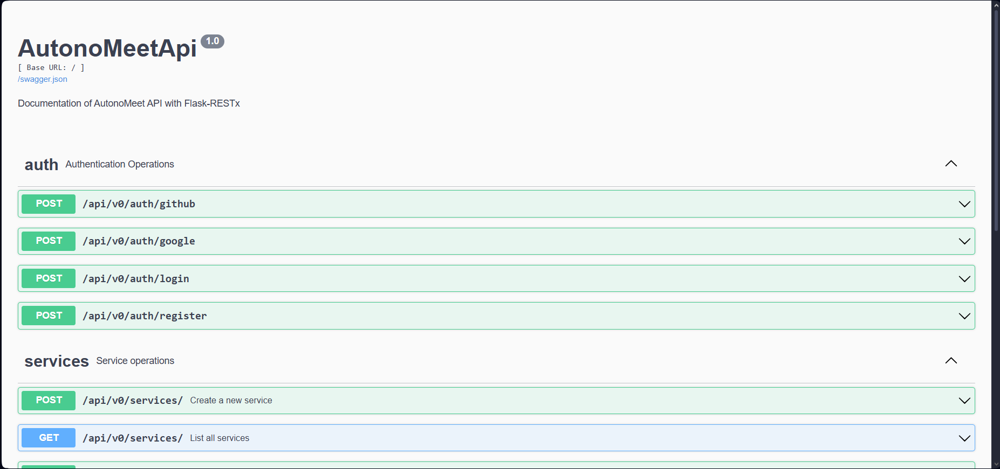

# AutonoMeet - Service Platform for Freelancers

## Team Information

### Team Name: AutonoMeet

#### Members:
- **Carlos Honrado Cristobalena** (chonrc00@estudiantes.unileon.es)  
- **Daniel Torres Montoya** (dtorrm01@estudiantes.unileon.es)  

## Project Information

### Project Name: Service Platform for Freelancers

## Brief Description

AutonoMeet is a platform that allows freelancers to offer their services (such as hairdressing, plumbing, private tutoring, etc.), while clients can easily search, book, and pay for these services. Users can register, browse services by category, view freelancer profiles, schedule appointments, and make online payments.

## Target Audience

The platform is designed for freelancers who want to promote their services and for clients looking to quickly and efficiently hire reliable professionals.  

This project addresses:  
- **The lack of visibility for freelancers** who need a platform to showcase their work.  
- **The difficulties clients face** in finding and booking trustworthy services.  

Additionally, we aim to provide freelancers with a tool to:  
1. Quickly establish their online presence.  
2. Manage their business efficiently.  

## Functional Requirements

### **User Registration & Authentication**
- Freelancers and clients can register and log in to the platform.

### **Freelancer Profiles**
- Freelancers can create and manage their profiles, including:  
  - Service details  
  - Availability  
  - Pricing  
  - Customer reviews  

### **Service Search & Filtering**
- Clients can search for services based on:  
  - Categories  
  - Location  
  - Price  
  - Ratings  

### **Appointment Booking**
- Clients can schedule appointments with freelancers based on availability.

### **Payment System**
- Integration of an online payment system for secure transactions.

### **Screenshots of the Application**

Below are screenshots showcasing key features of the AutonoMeet platform:

- **Sign In Page**: User login interface.  
  
- **Sign Up Page**: User registration interface.  
  
- **Service Explorer**: Browse and filter available services.  
  
- **Create Service**: Freelancer interface for adding a new service.  
  
- **Freelancer Dashboard**: Overview of freelancer's services and bookings.  
  
- **Individual Service**: Detailed view of a specific service.  
  
- **Schedule Selection**: Interface for booking appointments.  
  
- **Payment Data**: Secure payment input interface.  
  
- **API Documentation**: Swagger interface for API endpoints.  
  
